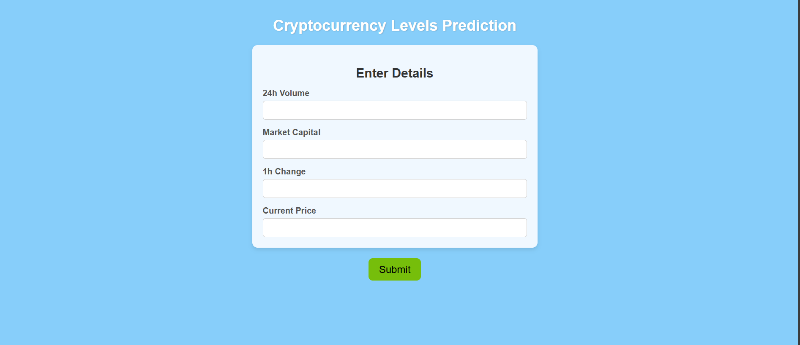

# 📈 Cryptocurrency Liquidity Prediction Project

Welcome to the Cryptocurrency Liquidity Prediction project! This notebook demonstrates the process of building a machine learning model to predict the liquidity of various cryptocurrencies. We cover everything from data cleaning to model evaluation and deployment.

## ✨ Project Overview

The goal of this project is to predict the liquidity of cryptocurrencies based on relevant market data. Liquidity is a crucial factor in cryptocurrency trading, and being able to predict it can be valuable for traders, investors, and exchanges.

---

## 🖼️ Demo

Below is a screenshot of the web interface where users can input cryptocurrency details to get liquidity predictions:

---

## Project Structure

## 📊 Data Exploration and Cleaning (EDA)

Our journey begins with a thorough exploration of the dataset. The data is loaded from a CSV file (`data_with_liquidity.csv`) and contains information about various cryptocurrencies, including:

- **coin:** Cryptocurrency name
- **symbol:** Cryptocurrency symbol
- **date:** Date of the data point
- **liquidity:** The target variable we aim to predict
- **24h_volume:** Trading volume over the past 24 hours
- **mkt_cap:** Market capitalization
- **1h:** 1-hour price change
- **price:** Current price

During the EDA phase, we perform the following steps:

- Inspect the dataset's structure and content.
- Examine the range of the 'liquidity' column (it's noted that it ranges from 0 to 1).
- Add a new column, `liquidity_level`, to categorize cryptocurrencies as 'High' (1) or 'Low' (0) based on a liquidity threshold of 0.5.

**Data Cleaning:**

We perform a crucial data cleaning step by removing columns that are not intended to be used as features for the model. We identified 'coin', 'symbol', and 'date' as unnecessary for our prediction.

## ⚙️ Feature Selection and Preprocessing

Based on our initial data exploration and understanding of the project's goal, we made a deliberate decision to use a specific subset of features for training our model. While the original dataset contained more columns, we narrowed it down to those most relevant for predicting liquidity.

The features that we selected and used for training the Random Forest Regressor are:

- **`24h_volume`:** The trading volume over the past 24 hours, indicating market activity.
- **`mkt_cap`:** The market capitalization, representing the total value of the cryptocurrency.
- **`1h`:** The percentage change in price over the last hour, reflecting recent price movements.
- **`price`:** The current price of the cryptocurrency.

We chose these features because they are considered relevant indicators of cryptocurrency liquidity. By focusing on these specific columns, we aim to build a more focused and potentially more effective model.

**Data Splitting:**

The selected features (`X`) and the target variable (`y` - 'liquidity') are split into training and testing sets using `train_test_split` with a `test_size` of 0.2 and a `random_state` for reproducibility.

**Feature Scaling:**

To ensure that features with different scales do not disproportionately influence the model, we apply `StandardScaler` to standardize the training and testing data. The fitted scaler is then saved for future use.

## 🧠 Model Training - Random Forest Regressor

We choose the Random Forest Regressor as our machine learning model. Random Forests are an ensemble learning method that builds multiple decision trees and merges their predictions to improve accuracy and control overfitting.

The model is trained on the scaled training data (`X_train`, `y_train`).

## 🎯 Model Evaluation

After training, we evaluate the model's performance using the R-squared metric. R-squared measures the proportion of the variance in the dependent variable (liquidity) that is predictable from the independent variables.

We calculate and print the R-squared scores for both the training and test sets to assess how well the model fits the data and generalizes to unseen data.

## 🛠️ Hyperparameter Tuning with GridSearchCV

To further optimize the model's performance and address potential overfitting, we perform hyperparameter tuning using `GridSearchCV`. This technique systematically searches through a predefined grid of hyperparameters to find the best combination.

The `param_grid` for the `RandomForestRegressor` includes:

- `n_estimators`: The number of trees in the forest.
- `max_depth`: The maximum depth of the trees.
- `min_samples_split`: The minimum number of samples required to split an internal node.

`GridSearchCV` is configured with `scoring='r2'` and `cv=5` (5-fold cross-validation). The best parameters found by GridSearchCV are then used to train the `best_model`.

We evaluate the performance of the `best_model` on the test set and also check its performance on the training set to compare with the initial model and assess the impact of tuning.

## 💾 Saving the Model and Scaler

The tuned Random Forest Regressor model (`best_model`) and the fitted `StandardScaler` are saved using `pickle`. This allows us to load the trained model and scaler later to make predictions on new data.

- `tuned_liquidity_model.pkl`: Contains the trained Random Forest Regressor model.
- `liquidity_scaler.pkl`: Contains the fitted StandardScaler.

## 🚀 Making Predictions

A Python function `predict_liquidity` is provided to make predictions on new data. This function takes the following inputs:

- `volume`: 24h trading volume
- `mkt_cap`: Market capitalization
- `h1`: 1-hour price change
- `price`: Current price

The function uses the loaded scaler to transform the input features and then uses the loaded model to predict the liquidity. It also outputs a liquidity level ("High" or "Low") based on the 0.5 threshold.

## ▶️ How to Run the Code

1. Ensure you have a Colab environment or Jupyter Notebook set up.
2. Upload the `data_with_liquidity.csv` file to your environment.
3. Install the required libraries: `pandas`, `numpy`, `scikit-learn`, `pickle`.
4. Run the code cells in the notebook sequentially.
5. The notebook will perform data loading, cleaning, feature selection, scaling, model training, tuning, and saving.
6. You can use the `predict_liquidity` function with your own input values to get predictions.

## 🔍 Future Enhancements

- Explore other regression models (e.g., Gradient Boosting, Support Vector Regression).
- Incorporate additional relevant features (e.g., social media sentiment, news headlines).
- Implement time series specific cross-validation techniques.
- Build a user interface or API to make predictions more accessible.

---

**Happy predicting!** 🎉
